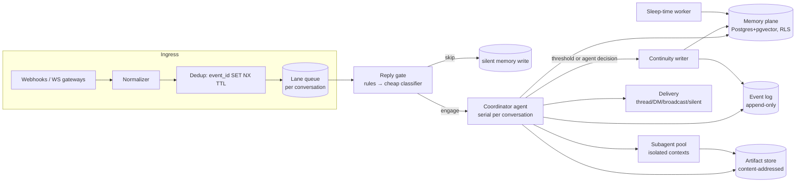

# PinkyAgent — Architecture

Headless, cloud-native agent runtime for long-horizon work in multi-user, multi-tenant
environments. Designed from scratch around one bet:

> **Continuity comes from memory, not from the context window.**
> The context window is a disposable working buffer. The event log and the memory
> plane are the agent.

Research basis: MemGPT/Letta, Mem0, Zep/Graphiti, Generative Agents, A-MEM, LangMem,
Manus context engineering, Anthropic context-editing + effective-harnesses, Cognition,
12-Factor Agents, Temporal/LangGraph/Restate/DBOS durable execution, E2B/Modal/Fly/
Firecracker sandboxing, AutoGen/OpenClaw/Slack ingestion patterns. Sources cited per
section.

---

## 1. Design pillars

| # | Pillar | Consequence |
|---|--------|-------------|
| P1 | **Event-sourced state** | A thread is an append-only event log. The prompt is a *projection* of the log, never the source of truth (12-Factor F12). Crash anywhere → rebuild from log. |
| P2 | **Deliberate context restarts** | No reactive compaction. The agent schedules its own restart, writes a **continuity document** first, then sheds the window and resumes on a fresh one seeded from continuity + memory. |
| P3 | **Memory plane with embeddings + vector store** | Scoped (tenant/agent/channel/user), typed (semantic/episodic/procedural), bi-temporally invalidated, hybrid-retrieved. |
| P4 | **Silence is a first-class output** | The agent is not a request/response function. Every ingress event ends in one of: reply, react, DM, defer, or silent memory-write. |
| P5 | **One writer, many readers** | A single-threaded coordinator per conversation owns all external writes. Subagents run parallel, isolated, read/compute-only, and return artifacts (Cognition's narrowed position). |
| P6 | **Durable by construction** | Every nondeterministic call (LLM, tool) is recorded once at an activity boundary. Human input is an async event, not a blocking call. |
| P7 | **Agent-to-agent comms, cross-machine** | Agents are addressable peers (`agentId@nodeId`). A2A is a durable Postgres mailbox with at-least-once delivery: in-process publish on one node, HMAC-signed HTTP relay between machines. Wake-on-message, no shared process. |
| P8 | **DB is the only config; agents cannot self-lobotomize** | All behavioral config (model, thresholds, gate) lives in the `settings` table — never in a config file. env bootstraps secrets/node identity only. The human CLI is the default write path; the runtime reads a snapshot per wake. An agent may change config **only** through a validated, journaled tool (`settings_set`), **only** for keys a human allow-listed (`selfConfig.allowedKeys`, off by default), and never `tenantId`, `selfConfig` itself, or the global scope. Validation happens before the write, so a value the agent gets wrong is a tool error it can read and retry — not a process that fails to boot on malformed config. Memory is heuristic-only; procedural promotion is human-gated (§13). |

---

## 2. System overview



Components are separable processes: **gateway** (ingress/delivery), **runtime** (agent
loop), **memory service**, **sleep-time worker**. MVP can run them in one process with
the same internal boundaries.

---

## 3. Core state model: the event log

A flat, append-only event log per **thread** (`tenant_id, channel_id, thread_id`). No
tree navigation, no branch pointer, no display transcript — those are interactive-UX
concerns this headless design does not need.

```ts
type ThreadEvent =
  | { type: "message"; role: "user" | "assistant" | "tool_result"; ... }
  | { type: "ingress"; platform: string; author: Principal; text: string; refs: string[] }
  | { type: "egress"; target: EgressTarget; text: string }        // what the outside world saw
  | { type: "decision"; action: "reply" | "react" | "dm" | "defer" | "silent"; reason: string }
  | { type: "continuity"; document: ContinuityDoc; tokensBefore: number }  // §4
  | { type: "subagent_spawn"; agent: string; task: string; outputRef: string }
  | { type: "human_request"; question: string; options?: unknown; status: "pending" | "answered" }
  | { type: "error"; source: string; message: string; count: number }      // compact errors (12F F9)
  | { type: "checkpoint"; ref: string }                                    // durable-execution marker
```

Rules:

- **Prompt = projection.** `buildContext(events, continuityBoundary)` walks back from the
  tail to the latest `continuity` event and renders: recalled memories → continuity doc →
  post-boundary events. The `<memories>` block goes first, at index 0, ahead of the
  document — it *is* the context start (§5.4), and it is journaled on its recall event so
  every later wake in the window replays the same bytes in the same slot (§4.5).
  Pre-boundary events are never sent to the model; they remain for audit, replay, and
  memory extraction.
- **No in-place mutation.** We never rewrite a stored tool result; an `elide` pointer
  event is recorded and the projection renders around it. The log stays append-only,
  which makes replay and cross-replica sync trivial.
- **Large payloads externalize** to the artifact store with content-addressed refs
  (`blob:sha256:…`). Compression is always *restorable*: drop content, keep the ref
  (Manus: "truncation must be restorable").

Rejected for this design: a tree/branch session model (interactive UX concern), in-place
result pruning (breaks append-only), and provider-native replay payloads (locks
continuity to one vendor).

---

## 4. The continuity engine (the heart)

This replaces compaction. Conventional compaction is **reactive**: it fires at
overflow/threshold and summarizes the past so the turn can continue. PinkyAgent's restart
is **deliberate**: the agent decides the moment and authors its own successor state.

### 4.1 Trigger ladder

1. **Agent-initiated (preferred).** A `shed_context` tool the agent calls at a natural
   boundary: task phase done, plan checkpoint reached, about to switch sub-problems.
2. **Advisory pressure.** At ~70% of the window, inject a harness notice: *"context
   pressure — evacuate what matters to memory or prepare continuity"* (MemGPT's warning
   token count; Anthropic's context-editing warning). It rides in a `user` turn, is
   journaled, and is armed from the log — once per **window**, not once per wake.
3. **Hard boundary.** At ~90%, continuity writing is forced as the next action. Never
   mid-tool-loop; only at a safe turn boundary.

### 4.2 The continuity document

Agent-authored, structured, validated. Written as a tool call (`write_continuity`), not
free text, so the harness can reject empty/low-signal documents (too few prior turns →
refuse; empty generation → throw).

```ts
type ContinuityDoc = {
  goal: string;                    // current objective, one paragraph
  plan: { done: string[]; now: string; next: string[] };   // recited, not summarized
  workingSet: {                    // what the successor must load
    files?: string[]; artifacts?: string[]; urls?: string[];
  };
  decisions: { what: string; why: string }[];               // implicit decisions made explicit
  openLoops: string[];             // unanswered questions, pending human requests
  lessons: string[];               // mistakes → extracted negative evidence (see 4.4)
  memoryHints: string[];           // queries the successor should run on wake
  mood?: string;                   // optional relational/affective note for persona continuity
};
```

### 4.3 The restart cycle

```text
  agent calls shed_context (or hard boundary hit)
        │
        ▼
  1. write_continuity(doc)            → validated, appended as `continuity` event
  2. retain(lessons + decisions)      → hot memory writes, embeddings queued
  3. flush pending tool state         → artifact refs resolved, error counters persisted
        │
        ▼
  FRESH CONTEXT =
    system prompt (stable prefix, cache-friendly)
    + continuity document
    + auto-recall(memoryHints + last ingress, top-k scoped)
    + small verbatim tail (last human message + agent's last action, ≤ ~2k tokens)
        │
        ▼
  agent resumes; first action is usually reading workingSet refs
```

The verbatim tail exists for conversational smoothness only; everything load-bearing must
be in the doc or memory. Successor quality is a *measurable* property: continuity eval =
can the successor answer "what are we doing, why, what's next, what did we try" without
seeing the prior window.

### 4.4 Resolving the "keep wrong actions" tension

Manus keeps failed actions + stack traces in context as negative evidence. Under restarts
that evidence is shed. Resolution (from the research synthesis): **extract, don't carry.**
At restart time, raw failures become `lessons` entries (semantic) and, when instructive,
episodic few-shot memories; the *counter* of consecutive failures lives in durable thread
state (`error` events, 12F F9) and escalates to a human at ~3. The successor gets the
lesson without the 4k-token stack trace.

### 4.5 Design details

- **Cut-point safety**: never restart mid-tool-call; metadata immediately before the cut
  is pulled into the kept region.
- **File-op tracking**: cumulative read/write sets feed `workingSet.files` automatically;
  the agent edits, doesn't reconstruct from memory.
- **Cache alignment**: the continuity write is a normal turn against the live prefix — a
  trailing user message on the same cache key, the full tool list unchanged. Never a
  shortened `tools` array: tool definitions render ahead of system and messages, so
  changing them invalidates *every* cache tier. `tool_choice` is cheaper but not free —
  it invalidates the messages tier, i.e. one uncached re-read of the whole transcript at
  exactly its largest — so the forced turn is **two-step**: the first attempt appends the
  hard notice and sends *no* `tool_choice` (appending extends the prefix and stays warm;
  the notice plus the harness guard, which errors every non-shed call, hold the boundary),
  and only the retry, after an attempt has already failed, buys the guarantee with
  `tool_choice: shed_context`. The *next* context starts a new cache prefix by design —
  restarts trade cache warmth for cleanliness, which is correct at agent-loop ratios
  (~100:1 input:output) only because the new window is small.
- **Speculative arming** (later): arm a continuity result in the pre-threshold band so a
  restart can commit instantly at a turn boundary.

Rejected: summary-of-conversation as the boundary payload (lossy, passive voice, no
agency), bitmap/image archival (clever token packing solving the wrong problem for us),
and auto-continue prompts (the successor is a fresh agent, not a resumed one).

---

## 5. The memory plane

### 5.1 Scopes and isolation

Every memory row carries a scope tuple:

```sql
tenant_id   text not null,      -- hard isolation boundary (RLS predicate)
agent_id    text not null,      -- which persona/agent owns it
visibility  text not null,      -- 'private' | 'user' | 'channel' | 'tenant' | 'global'
user_id     text,               -- subject principal, when about a user
channel_id  text,               -- subject channel, when about a shared space
```

Enforcement below the app layer: Postgres **row-level security** on `tenant_id`
(transaction pooling only — never statement pooling with RLS GUCs), plus app-level
visibility filters. A missing `WHERE` cannot leak (Oracle pattern; pgvector+RLS per
Tiger Data). Recall in a shared channel sees `tenant + channel + global` scopes;
DMs additionally see `user` scope; the agent's private scratch (`private`) is never
projected into shared-channel context.

A recalled block is journaled with the width it was searched under (`includeUser` /
`includePrivate`) because later wakes replay it (§5.4). A wake on a **narrower** surface
— `pinky headless --shared` picking up a window a default run opened — strips the
replayed block and re-recalls under its own scope rather than inheriting rows it is not
allowed to see; the wider direction replays unchanged, since a wide reader seeing a
narrow block leaks nothing. Privacy costs one cache-prefix break per narrow wake, and
only on a thread someone drives both ways.

### 5.2 Memory types (LangMem taxonomy)

| Type | Shape | Written by | Example |
|------|-------|-----------|---------|
| **Semantic** | fact rows, bi-temporal (`valid_from/valid_to`, `recorded_at`) | hot tools + sleep worker | "Bradd prefers terse answers" |
| **Episodic** | event episodes w/ embedding | sleep worker mostly | "2026-08-20: deploy failed on missing env var; fixed by…" |
| **Procedural** | rules/skills, versioned | explicit `learn` + promotion | "Always check `publishable` before POS writes" |
| **Working** | the continuity doc + thread tail | continuity engine | (not in vector store) |

Facts are **invalidated, not deleted** (Zep/Graphiti): a contradicting fact sets
`valid_to` on the old row. Current-truth queries filter `valid_to is null`; temporal
queries can reconstruct any point. Mem0's 2026 retreat from UPDATE/DELETE to ADD-only
accumulation is the same lesson: destructive LLM-driven edits degrade memory quality.

### 5.3 Write paths

1. **Hot path (agent tools)** — the agent-facing memory surface:
   `recall`, `retain`, `reflect`, `memory_edit(update|forget|invalidate)`, plus `learn`
   for procedural lessons. Retains are batched every N turns.
2. **Continuity path** — decisions/lessons at each restart (§4.2).
3. **Sleep-time worker** — Letta's sleep-time compute plus a two-phase pipeline:
   - *Extraction* (per thread, idle-gated): candidate facts from recent events (Mem0:
     summary + last ~10 messages + new pair).
   - *Update*: for each candidate, retrieve top-10 similar, LLM picks
     **ADD / UPDATE / DELETE / NOOP** (Mem0's tool-call loop) — with DELETE implemented
     as invalidation.
   - *Consolidation*: cross-thread synthesis into curated long-term docs + procedural
     skill promotion (Generative Agents' reflection).
   Runs on cron/idle, shares the memory plane, never touches live context.

   **Built (slice 6).** The scheduler holds no state, in §7/§8.1's shape: a timer in
   `pinky headless` (or `pinky sleep run` from cron) asks the log which threads are due —
   newest event at least `sleep.idleMs` old, something extractable past the cursor — and
   each pass journals a `sleep` **receipt** inside the transaction that made its memory
   writes, under the thread lock. There is no "last run at" anywhere: the cursor is the
   newest receipt's `toSeq`, so a crash before commit leaves neither rows nor receipt and
   the next sweep redoes the pass, while two passes racing serialize on the lock and the
   loser writes nothing. The idle gate is also the retry backoff — a failed pass journals
   an `error`, which is a new newest event. Every event either phase appends is
   audit-only, so §4.5's byte-for-byte prefix is untouched by a sweep.
   Consolidation reads **wider** than any conversation and writes **narrower**: a
   worker-only `allChannels` scope arm makes `channel`-visibility rows of every channel
   legible (§5.1 says a run sees one channel; a pass that consolidates the plane has to
   see all of it), and the insight it synthesizes is placed by its sources — one channel
   → that channel, none → tenant, **two or more → dropped**, because there is no honest
   place for it. A row may only be superseded by an insight at exactly its own placement.
   The same never-widen rule constrains extraction's UPDATE/DELETE: a target whose
   visibility (and channel or user) differs from the candidate's is refused and counted
   as a NOOP — the neighbour list is wider than the candidate, and re-filing a fact is
   not an edit of it. What extraction *may* do is write a `tenant`-visible row out of one
   channel's transcript, exactly the latitude the `retain` tool already gives the agent
   (§5.1); the normative rule is the narrower one it constrains: **reflection never
   widens channel content**, and reflection is also the only path that could, since it is
   the only one that reads across channels. Reflection excludes its own output
   (`meta.source = "sleep:reflect"`) from the next batch, or it would spend itself
   consolidating consolidations. Procedural skill promotion is **not** built and is not a
   later increment of this pass: §13 says it starts human-approved, so the reflect schema
   has no `procedural` kind and every insight is retained `semantic`. What each pass cost
   and produced is one query over the receipts (`pinky stats sleep`, §13).

### 5.4 Retrieval

Hybrid, fused, cheap:

- **Signals**: vector cosine + BM25/FTS + recency/importance scoring
  (Generative Agents: `α·recency + β·relevance + γ·importance`, recency decay γ≈0.995;
  importance = LLM-assigned 1–10 at write time).
- **Fusion**: reciprocal rank fusion across vector, fact, and temporal voices (a graph
  voice is a later addition).
- **Budgeted injection**: token-capped `<memories>` block at context start and after each
  restart (~5k tokens). Memory is injected as **background context, not instructions**;
  current messages and tool output win conflicts. The rendered block is journaled on the
  `memory` recall event and replayed from there by the projection, so the search runs once
  per **window** — its first wake, and again right after each restart — not once per wake:
  a live re-search would re-render byte 0 whenever a retention landed or a score moved,
  and a moved byte 0 misses the prefix cache for the whole thread (§4.5). The gate is the
  **presence of the `block` key**, not its text: a pass that found nothing journals
  `block: ""` and still claims the window (only a non-empty block is injected), while a
  pass whose store failed journals nothing and is retried on the next wake — for a broken
  store, eventual recall beats prefix stability. The agent's own `recall` tool writes no
  key, so it cannot claim a window or move byte 0. Two things override a journaled block,
  both deliberate prefix breaks: memory turned off for the run, and a scope narrower than
  the block was built under (§5.1), which strips it and re-recalls.
- **Latency target**: p95 search < 300ms (Mem0 reports 0.2s; Zep 155–162ms) — achievable
  with pgvector HNSW at memory-plane scale.

### 5.5 Storage and embeddings

- **Postgres + pgvector**, one HNSW index, RLS tenancy. Also holds the event log and
  checkpoints → one transactional store, no vector/OLTP split-brain. (Qdrant partition
  keys are the fallback if vector QPS ever dominates.)
- **Embeddings**: `text-embedding-3-small` (1536d, $0.02/MTok, Matryoshka-truncatable to
  512 for the hot index). Behind an interface so a local `bge-base` variant works for
  dev/edge.

---

## 6. Reply gating: when to speak

> Implementation note: with the JSONL stdio ingress (§11) every prompt is addressed to
> the agent by construction, so the gate below is inert — it comes back with the first
> multi-party ingress.

Every ingress event flows:

```text
persist raw event → dedup (event_id, Redis SET NX + 48h TTL)
  → drop bot-authored messages (loop break)
  → per-conversation lock (one in-flight run per thread; Nylas: dedup AND lock, either alone insufficient)
  → debounce ~500ms same-author burst → one batched turn (OpenClaw)
  → RULE CASCADE (free, deterministic):
      direct mention / reply-to-agent / DM        → ENGAGE
      owner command                               → ENGAGE
      rate limit / cooldown exceeded              → SILENT
      obvious noise (emoji-only, sticker)         → SILENT
  → CHEAP CLASSIFIER (Haiku-class, YES/NO relevance + suggested target)   [Agente-Discord pattern]
  → COORDINATOR TURN with full context
```

The coordinator's turn ends in a **decision event**: `reply` (thread), `broadcast`
(channel), `dm`, `react` (emoji), `defer` (re-arm on new evidence or cron), or `silent`
(memory write only). Silence-with-memory-write is the default for ambient chatter: the
agent is *present* in the channel's life without performing presence. AutoGen's speaker
selection shows the cleanest formulation: the selection function may return `None`, and
`None` terminates the chat — non-participation is a valid, representable outcome.

Mid-run arrivals get queue modes (OpenClaw): `steer` (inject into active run),
`followup` (queue after), `collect` (batch into next wake), `interrupt` (owner only).

---

## 7. Orchestration: serial and parallel subagents

- **Coordinator owns writes** (P5). Subagents are spawned for parallelizable
  read/compute: research, codebase mapping, draft candidates, verification.
- **Isolated contexts, prompt-only channel**: the only parent→child input is the task
  prompt + explicit refs; the only child→parent output is a structured artifact (a
  content-addressed ref + optional JSON schema). No context inheritance — which means
  **subagents are context restarts by construction**, the same primitive as §4 applied
  spatially instead of temporally.
- **Parallel fan-out**: Send-style scatter → gather; results converge at the coordinator
  (LangGraph `Send`). Cap concurrency; per-tenant quota too. Never let two subagents
  write the same surface — ownership is partitioned at dispatch.
- **Serial chains**: handoff = the coordinator re-tasks itself or a successor with a
  continuity-shaped brief (Swarm's handoff-with-input-filter, but the payload is a
  ContinuityDoc, not raw history).
- **Agent definitions**: markdown frontmatter — `name`, `description`, `systemPrompt`,
  `tools`, `spawns` (what it may spawn), `model` (role aliases), `output` schema,
  `blocking`. Spawn policy with depth cap and self-recursion guard.
- **Steering**: live agents are addressable peers — `send`, `wait`, park → revive. In
  cloud form: an agent mailbox table + wake-on-message (§P7).

### 7.1 The tool plane: header vs catalog

Tool definitions render at prefix position 0 (`tools → system → messages`), so the tool
list is the head of every cache key and its size is a bill paid on every request. An MCP
server publishes tens to hundreds of tools, and the set moves whenever a server is added,
restarted or updated — which would invalidate every cache tier for the whole thread (§4.5,
§9). The partition is therefore explicit:

- **Header** = the always-on tools + `shed_context` + three fixed meta-tools
  (`tool_search`, `tool_describe`, `tool_call`). Those four names can never be moved out:
  the hard boundary forces `shed_context` by name, and deferring the search tool would
  leave the model a door it cannot find.
- **Catalog** = everything else, in a Postgres table (name, description, JSON Schema,
  flattened argument text for FTS), invalidated-never-deleted like the memory plane so a
  name from an old continuity document still resolves.
- **Which is which** is a setting, per tool and per source, so a human — or a delegated
  agent under P8 — chooses what the header costs. Precedence:
  `alwaysOn` > `deferred` > `defaultMode[builtin|mcp]`; built-ins default to the header,
  MCP tools to the catalog.

**A loaded schema is appended, never a header rewrite.** `tool_describe` and `tool_call`
answer as ordinary tool results, so discovering and using a tool extends the prefix the
same way any other turn does; the system prompt names the three meta-tools in one static
sentence and never enumerates the catalog. The partition is recomputed per run from the
reloaded settings, which makes a header change a deliberate act with a visible price (one
cold prompt) rather than a side effect of a server coming back up.

Phase 1 (built) is that uniform meta-tool path, and it works on every provider route.
Phase 2 (later) is provider-native deferral — Anthropic's `defer_loading` / `tool_reference`
— riding the *same* catalog: the model gets names in the header and pulls schemas on
demand, while `tool_search`/`tool_call` stay as the portable fallback for routes without
it. The catalog is the durable half either way, which is why it is a table and not a
process's in-memory list.

---

## 8. Durability and execution

### 8.1 Durable execution

The agent loop is a reducer over the event log; every side effect is journaled:

- **LLM calls and tool calls are activity boundaries** (Temporal discipline): record the
  result once, never re-execute on recovery. Recovery = project log → resume at last
  checkpoint event.
- **Checkpoint per turn boundary** (LangGraph checkpointer semantics: values, next,
  pending writes; `checkpoint_writes` so a sibling failure doesn't re-run finished work).
- Implementation: Postgres-first (DBOS-style: step result commits in the same tx as its
  state writes). Temporal/Restate only if we outgrow it — Restate's virtual objects
  (keyed single-writer state + FaaS suspension) map beautifully onto per-conversation
  agents, defer the decision.
- **Wake sources** are all the same shape: ingress webhook, cron heartbeat, human
  response, subagent completion, timer. One `wake(thread_id, cause)` entry point
  (12F F11: trigger from anywhere).

### 8.2 Human-in-the-loop

Async by construction (12F F7): agent emits `human_request` → persisted → notify on
whatever channel the human inhabits → **loop breaks** (no held compute; Restate-style
suspension costs nothing while waiting). The human's reply is just another ingress event
that wakes the thread. Approval carries the originating tool-call id for correlation
(Ably pattern). Urgency levels: `block` (stop until answered) vs `fyi` (proceed, answer
folds in later).

### 8.3 Sandboxed execution

Agent state never lives inside the sandbox — the log is the state. Sandboxes are
disposable tool-execution environments:

- MVP: process-level isolation (container per tenant-job).
- Untrusted/arbitrary code: Firecracker-grade microVMs (E2B hosted: ~150ms cold start,
  pause ~4s/GiB, resume ~1s; or raw Firecracker snapshot API if self-hosting).
- VM snapshots restore *process RAM*, not agent context — irrelevant to us by design
  (P1/P6). Useful only for warm tool environments (pre-installed deps, warm caches).

---

## 9. Failure-mode defenses (research-backed)

| Failure | Evidence | Defense |
|---|---|---|
| Lost-in-the-middle | Liu et al. TACL'24: >30% drop mid-window | Recitation: plan/goal re-rendered near context tail each turn (Manus todo.md); restarts keep windows small |
| Context rot | Chroma 2025: 18 models degrade with length, distractors amplify | Small windows via restarts; retrieval separated from reasoning; no giant summarized prefixes |
| Context poisoning | Gemini Pokémon case: hallucination embedded in goals | Memory is heuristic, never authoritative; continuity docs cite artifact refs, not vibes |
| Error accumulation | non-Markovian compounding across stages | Lesson extraction at restarts; error counters in durable state; human escalation at 3 |
| Distractor confusion | Breunig: sharded prompts −39% | One coordinator per conversation; subagent outputs arrive as single curated artifacts |
| Few-shot mimicry loops | Manus: uniform patterns induce mimicry | Structured variation in event serialization; timestamps only in log, not prompt prefix (cache + mimicry) |
| KV-cache thrash | Manus: 10× cost delta cached vs not | Stable system prefix; append-only within a window; tool set masked not mutated mid-window, and the mask itself deferred to the forced retry (§4.5); conversation breakpoints on the last two messages; notices and the recall block journaled, and tool-call arguments canonicalized on both sides of the log so jsonb key order cannot move a byte — wake N+1 is a byte-extension of wake N |
| Tool-list churn at position 0 | Tool defs render ahead of system and messages; an MCP server's list moves under you | Header/catalog partition (§7.1): the header is a small fixed set, everything else is a catalog reached by three meta-tools, and loading a tool appends a result instead of rewriting the header. A server's rows are trusted by config hash on start and kept across an outage, so the header is identical before and after a connect |
| Destructive memory edits | Mem0 2026: UPDATE/DELETE degrade quality | Invalidation-not-deletion; sleep-worker-only consolidation; hot edits limited to append + annotate |
| Memory stagnation and consolidation drift | Generative Agents: reflection is what turns observations into standing beliefs; Mem0: unreviewed accumulation degrades retrieval | The sleep-time worker (§5.3 item 3) is the one path allowed to consolidate, off the live path and idle-gated. Its drift risks are bounded structurally rather than by prompt: it never reads its own insights back as fresh material, an insight is never wider than the channels that fed it, a superseded row must sit at the insight's own placement, and every pass leaves a receipt so the whole history is `pinky stats sleep` |

---

## 10. Key design decisions

| Decision | Rationale |
|---|---|
| Linear event log per thread in Postgres | Headless — no tree UI; enables replay + multi-replica sync |
| Deliberate restart + ContinuityDoc boundary | Agency + timing; a summary is passive, a doc is intentional |
| Agent-authored continuity doc, validated schema | The successor's fidelity is a first-class, testable artifact |
| Memory tools `recall/retain/reflect/memory_edit/learn` | A small, sufficient agent-facing memory API |
| `tenant/agent/visibility/user/channel` scopes + RLS | Chat topology; isolation enforced below the app layer |
| Content-addressed artifact store (`blob:sha256:`) | Restorable compression; dedup by content |
| Subagent frontmatter (spawns, depth cap, output schema) | Subagent governance without a shared process |
| A2A mailbox + wake-on-message | Peer steering semantics with no TUI and no shared process |
| Batched retains + idle gates + suspend-flush | Cloud suspend replaces process exit; nothing lost on the floor |
| Lifecycle middleware (`agent_start`, `tool_call`, `context`) | Extension points without forking the loop |

---

## 11. Tech stack

- **Runtime**: Bun + TypeScript — single language across gateway/runtime/tools, fast cold
  start. (Python alternative only if ML-ecosystem deps dominate later.)
- **DB**: Postgres 16 + pgvector (events, checkpoints, memories, mailboxes). Redis for
  dedup/locks/queues — or `pgmq` to stay one-store at MVP.
- **LLM layer**: provider-agnostic with role aliases (`default`, `smol`, `advisor`),
  prompt-cache-aware.
- **Embeddings**: `text-embedding-3-small` behind an interface; local bge for dev.
- **Tools over MCP**: `@modelcontextprotocol/client` 2.0 (spec revision 2026-07-28:
  stateless, Streamable HTTP, `server/discover` negotiation with an automatic fallback to
  the 2025 `initialize` era, `tools/list` freshness hints, `subscriptions/listen` for list
  changes). The second — and only other — runtime dependency in the repo besides
  `postgres`. Roots, sampling and logging are deprecated in that revision and not
  implemented. Servers are declared in the settings table, never a file, and are
  human-write-only (§P8).
- **Gateways**: a JSONL stdio protocol is the primary ingress — one command object per
  stdin line, one event object per stdout line, for a long-lived process another program
  drives (the pi-headless shape). It needs no socket, no signature verification and no
  reply gate, and the ordering contract is per thread. Slack and Discord are out of the
  MVP; a webhook-generic ingress can come back when there is a second party to gate.

---

## 12. Build order (MVP slices)

1. **Core loop + event log + JSONL headless ingress**. Linear thread, projection,
   Postgres. Every prompt on the pipe is addressed to the agent. No memory yet beyond
   the log.
2. **Memory plane v1**: pgvector, scopes, hot tools (`recall/retain`), auto-recall at
   context start, hybrid retrieval (vector + FTS).
3. **Continuity engine**: `shed_context` + `write_continuity`, threshold ladder, restart
   projection. **This is the differentiator — build it third, not last.**
4. **Reply gating**: rule cascade → cheap classifier → decision events; debounce, locks,
   queue modes.
5. **Subagents**: isolated spawn, artifact return, parallel fan-out, depth caps.
6. **Sleep-time worker**: extraction (ADD/UPDATE/DELETE/NOOP), consolidation, reflection.
   **Built**, out of order — ahead of 4, 5, 7 — as a standalone wave: idle-gated
   extraction per thread and cross-thread reflection, each committing its receipt with
   its memory writes, driven by a timer in `pinky headless` or by `pinky sleep run` from
   cron, and measured with `pinky stats sleep`. Procedural skill promotion is excluded on
   purpose (§13).
7. **HITL**: `human_request` events, notify-and-break, webhook resume.
8. **Hardening**: sandboxed execution, per-tenant quotas, memory ABAC polish, temporal
   graph voice in recall.
9. **MCP + deferred tools** (§7.1): the `tool_catalog` table, the three meta-tools, the
   header/catalog partition from settings, and an MCP client plane that syncs configured
   servers into the catalog and dispatches `tools/call`. Built out of order — ahead of 4–8
   — because the tool header is a prefix-position-0 cost that every later slice pays.

---

## 13. Open questions

- **Continuity eval harness**: what's the successor-fidelity metric and the regression
  suite for it? (Proposed: QA pairs over "goal/state/next/tried" + task-completion delta
  vs. non-restart baseline.)
- **Classifier distillation**: can the YES/NO gate become a fine-tuned tiny model trained
  on the coordinator's own decision events?
- **Cross-channel identity**: principal resolution (Slack user ↔ GitHub user ↔ email) —
  punted to v2 with a `principal_aliases` table.
- **Procedural memory promotion**: when does a repeated lesson become a system-prompt
  rule? Dangerous if automatic — start human-approved. Still open with slice 6 built: the
  sleep worker's reflect schema has no `procedural` kind, so nothing it synthesizes can
  promote itself.
- **`tool_catalog` has no RLS** (§7.1, §8.3): it holds tool schemas rather than user data
  and every read and write states `tenant_id`, but `memories` is still the only table with
  a database-side policy. The follow-up belongs with slice 8, when RLS is extended past
  the memory plane — the GUC and the `withTenant` wrapper it keys on are already there.
- **No index on `memories(recorded_at)`** (§5.3 item 3): the sleep worker's reflect batch
  reads forward from a `(recorded_at, id)` watermark, so it is a scan under the scope
  predicate — one page per sweep at plane scale, which is nothing, but it is the first
  read whose cost grows with the plane rather than with the query. The index belongs with
  slice 8's storage pass, together with the RLS item above, and its expression has to
  match the truncated one the cursor compares on.
- **Per-channel MCP servers**: `mcp.servers` is read once at bootstrap from the global +
  agent scopes, so a channel-scoped row is ignored (and warned about). Honoring one means
  a manager and a set of child processes per channel — a lifecycle question, not a config
  value — and it is unanswered until there is a second party on the pipe (§6).
- **Cost model**: restarts discard cache warmth; measure $/task vs a compaction baseline
  early (pillar P2's main economic risk). Instrumented rather than deferred: `pinky stats
  restarts` prices each rebuild's first turn, `pinky stats cache` the steady-state hit
  rate between them (cold transitions and prefix rewrites named, not averaged away).
