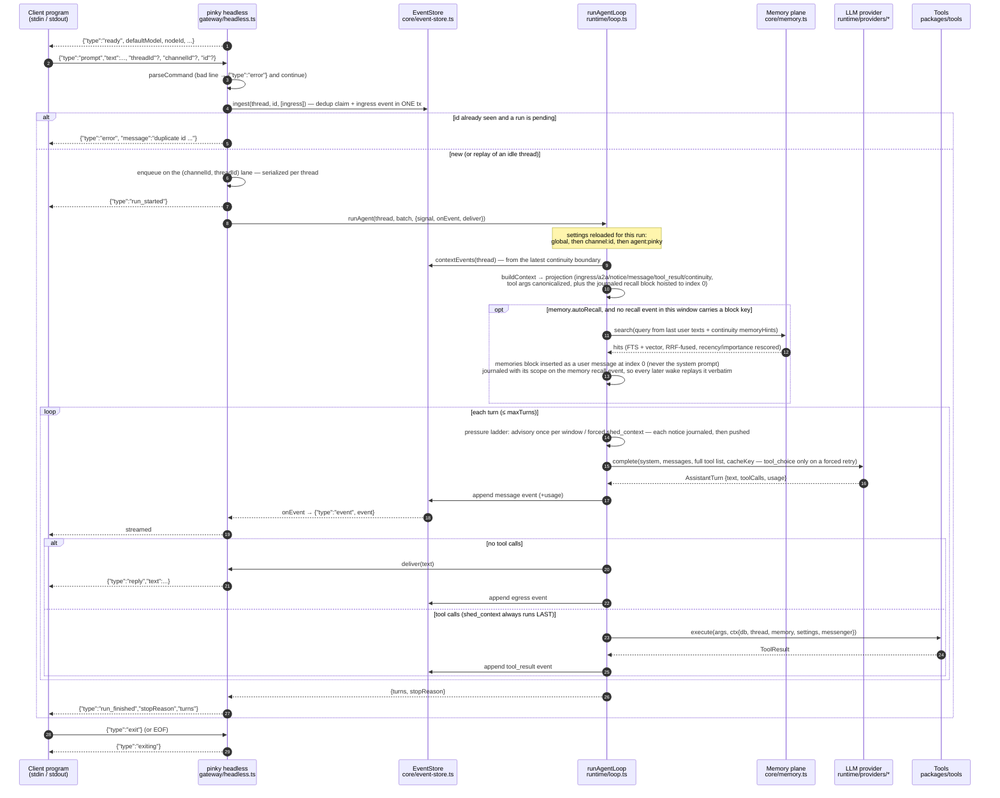
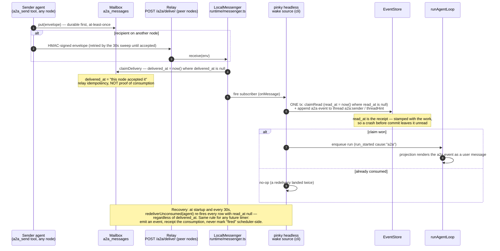

# PinkyAgent — agent flow

How one prompt travels from a client program to a reply, and what the agent
loop does in between. Diagrams follow the code as of the prompt-cache alignment
work; the file paths in the notes are where each box lives. DESIGN.md is still
the spec — this is the map of what is built.

## 1. End to end: JSONL client → headless service → agent loop → reply

Every event the loop appends is streamed live through `onEvent`; the `ingress`
written by `ingest` predates the run and is not re-streamed. Ordering is
guaranteed per thread: `run_started → (event | reply)* → run_finished`.

## 2. Inside one run: the turn cycle and the continuity restart

```mermaid
flowchart TD
    start([run starts]) --> load[loadContext: events since the latest continuity event<br/>buildContext → projection<br/>non-empty journaled recall block hoisted to index 0, notices in seq order<br/>tool args canonicalized on both sides of the log]
    load --> journaled{"windowRecall: does this window already<br/>carry a recall event with a block key?"}
    journaled -- "yes, memory on, scope not narrower" --> opened
    journaled -- "no key, or memory off, or narrower scope than journaled" --> recall{memory.autoRecall<br/>and memory context?}
    recall -- yes --> block["autoRecall: FTS + vector search, budgeted<br/>&lt;memories&gt; block → user message at index 0<br/>journaled with block + scope on the memory recall event<br/>found nothing → empty block, still claims the window<br/>store failed → nothing journaled, retried next wake"]
    recall -- no --> opened
    block --> opened{window opens on a<br/>continuity boundary?}
    opened -- yes --> restart0[emit restart event<br/>tokensBefore / tokensAfter / recallTokens]
    opened -- no --> ladder
    restart0 --> ladder

    ladder{estimateTokens vs<br/>context.* thresholds}
    ladder -- "≥ hardFraction" --> forcing{"first forced attempt, or the retry?<br/>full tool list kept either way"}
    ladder -- "context cap truncated the window" --> forcing
    forcing -- first --> hard1["append notice event, then push HARD notice as user msg<br/>NO tool_choice — appending keeps the messages cache warm;<br/>the note plus the harness guard hold the boundary"]
    forcing -- "retry — last attempt" --> hard2["append notice event, then push HARD RETRY notice as user msg<br/>tool_choice: shed_context — the guarantee, paid for with<br/>one uncached re-read of the transcript"]
    ladder -- "≥ advisoryFraction — once per window, armed from the log" --> adv[append notice event, then push ADVISORY notice as user msg]
    ladder -- below --> llm
    hard1 --> llm
    hard2 --> llm
    adv --> llm

    llm[provider.complete<br/>system prompt = stable cached prefix, never rewritten] --> journal[append message event<br/>with usage: input / output / cacheRead / cacheCreation]
    journal --> calls{tool calls?}

    calls -- none --> deliver[deliver text → reply line<br/>append egress event]
    deliver --> forced{forced shed turn?}
    forced -- no --> done([completed])
    forced -- yes --> miss[count forced-shed miss]
    miss --> giveup{2 misses?}
    giveup -- yes --> failed([shed_failed])
    giveup -- no --> ladder

    calls -- some --> order[sort: shed_context runs LAST<br/>cut-point safety]
    order --> exec[execute each tool<br/>append tool_result per call]
    exec --> tools

    subgraph tools [tools available to the agent]
        direction LR
        fs[read / write / edit / glob / grep<br/>sandboxed under cwd]
        bash[bash — opt-in only<br/>prompt, or headless --shell]
        mem[recall / retain / memory_edit<br/>→ memory plane, memory events]
        cfg[settings_get / settings_set<br/>human allow-listed, validated before write,<br/>config event]
        a2a[a2a_send / a2a_inbox<br/>→ mailbox]
        shed[shed_context<br/>validates ContinuityDoc → continuity event]
    end

    tools --> shedq{shed_context<br/>succeeded?}
    shedq -- no --> more{turns left?}
    more -- yes --> ladder
    more -- no --> maxed([max_turns])
    shedq -- yes --> rebuild[NEW BOUNDARY: reload projection from the continuity event<br/>re-run autoRecall with the memoryHints in the query<br/>emit restart event]
    rebuild --> more2{turns left?}
    more2 -- yes --> ladder
    more2 -- no --> paused([shed — resumes on next wake])
```

Nothing in the log is ever rewritten: a restart moves the projection boundary
forward, and everything before it stays for audit, replay, memory extraction
and `pinky stats restarts`.

Everything the loop pushes into `messages` it journals first — the pressure
notices as `notice` events, the recalled block on its `memory` recall event —
so the next wake's projection reproduces the same bytes in the same slots and
the request stays a prefix-extension of the one the provider already cached.
The same reason the loop and the projection both canonicalize tool-call
arguments: jsonb re-sorts an object's keys, and a replayed `tool_use` that
differs by one byte breaks the match from there to the end of the transcript.
`pinky stats cache` is where you check that it held.

## 3. Wake-on-message: an A2A envelope becomes a run

## Where the pieces live

| Box | File |
| --- | --- |
| JSONL protocol, lanes, wake seam | `packages/gateway/src/headless.ts` |
| Bootstrap, per-run settings reload, wake wiring, `pinky` commands | `packages/cli/src/index.ts` |
| Ingest (dedup + append in one tx), projection window | `packages/core/src/event-store.ts` |
| Projection rules (what the model sees) | `packages/core/src/projection.ts` |
| Turn cycle, pressure ladder, restart | `packages/runtime/src/loop.ts` |
| Auto-recall block | `packages/runtime/src/memory-recall.ts` |
| `shed_context` + ContinuityDoc validation | `packages/runtime/src/continuity.ts` |
| Memory store (scopes, FTS + vector, fusion) | `packages/core/src/memory.ts` |
| Mailbox receipts, messenger delivery/redelivery | `packages/core/src/mailbox.ts`, `packages/runtime/src/messenger.ts` |
| Tools | `packages/tools/src/*.ts` |
